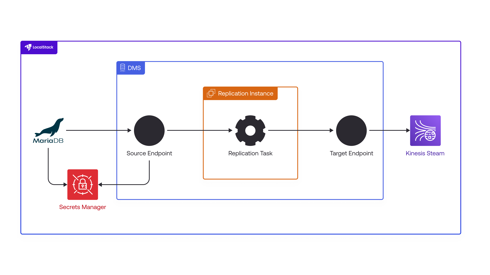

# Real-time Database Replication with DMS and Kinesis on LocalStack

| Key          | Value                                                                                    |
| ------------ | ---------------------------------------------------------------------------------------- |
| Environment  | LocalStack, AWS                                                                          |
| Services     | DMS, RDS, Kinesis, VPC, Secrets Manager                                                  |
| Integrations | AWS CDK, Docker Compose, AWS SDK for Python                                              |
| Categories   | Database Migration, Change Data Capture, Streaming                                       |
| Level        | Intermediate                                                                             |
| Use Case     | Database Migration, Real-time Data Replication, CDC Implementation                       |
| GitHub       | [Repository link](https://github.com/localstack-samples/sample-dms-cdc-rds-to-kinesis)          |

## Introduction

This sample demonstrates how to use AWS Database Migration Service (DMS) to create change data capture (CDC) and full load replication tasks using the AWS Cloud Development Kit in Python. The application showcases real-time data replication from MariaDB databases to Kinesis streams, enabling you to capture and stream database changes as they occur. It is a self-contained setup that will create a local VPC to host 2 databases, a Kinesis stream, and 4 replication tasks. To test this application sample, we will demonstrate how you use LocalStack to deploy the complete DMS infrastructure on your developer machine and validate the data replication workflow locally. This provides a cost-effective way to develop and test database migration patterns before deploying to production AWS environments.

## Architecture

The following diagram shows the architecture that this sample application builds and deploys:



- [VPC](https://docs.localstack.cloud/aws/services/ec2/#vpc) with custom networking to host database resources
- [RDS MariaDB instance](https://docs.localstack.cloud/aws/services/rds/) as the target database for CDC replication
- External MariaDB container as the source database for full load replication  
- [DMS Replication Instance](https://docs.localstack.cloud/aws/services/dms/) to execute migration tasks
- [DMS Source/Target Endpoints](https://docs.localstack.cloud/aws/services/dms/) connecting to both MariaDB instances
- [DMS Replication Tasks](https://docs.localstack.cloud/aws/services/dms/) for full load and CDC operations
- [Kinesis Data Stream](https://docs.localstack.cloud/aws/services/kinesis/) as the target for replicated data
- [Secrets Manager](https://docs.localstack.cloud/aws/services/secretsmanager/) for secure database credential storage

## Prerequisites

- [`LOCALSTACK_AUTH_TOKEN`](https://docs.localstack.cloud/getting-started/auth-token/)
- [Python 3.10+](https://www.python.org/downloads/) & `pip`
- [Docker Compose](https://docs.docker.com/compose/install/) 
- [CDK](https://docs.localstack.cloud/user-guide/integrations/aws-cdk/) with the [`cdklocal`](https://github.com/localstack/aws-cdk-local) wrapper
- [`make`](https://www.gnu.org/software/make/) (**optional**, but recommended for running the sample application)

## Installation

To run the sample application, you need to install the required dependencies.

First, clone the repository:

```shell
git clone https://github.com/localstack/sample-dms-cdc-rds-to-kinesis.git
```

Then, navigate to the project directory:

```shell
cd sample-dms-cdc-rds-to-kinesis
```

Install all the dependencies by running the following command:

```shell
make install
```

This will create a virtual environment and install the required Python packages including AWS CDK dependencies.

## Deployment

Start LocalStack Pro with the `LOCALSTACK_AUTH_TOKEN` pre-configured:

```shell
export LOCALSTACK_AUTH_TOKEN=<your-auth-token>
make start
```

The Docker Compose file will start LocalStack Pro container and a MariaDB container that will serve as the external source database.

To deploy the sample application infrastructure, run the following command:

```shell
make deploy
```

After successful deployment, you will see the following output:

```shell
Outputs:
DMsSampleSetupStack.cdcTask1 = arn:aws:dms:us-east-1:000000000000:task:A001NYMR4Z0NK45ZBJT6954RNMGEKL2PQ9XQYR4
DMsSampleSetupStack.cdcTask2 = arn:aws:dms:us-east-1:000000000000:task:GO5RC4J6CKZWSJKF4CGB6ZV3ZEMGI38DFPJF2ZU
DMsSampleSetupStack.cdcTaskSecret = arn:aws:secretsmanager:us-east-1:000000000000:secret:DMsSampleSetupStack-rdsinstanceSecret07FEB42-907ed0cf-RSPkZq
DMsSampleSetupStack.fullTask1 = arn:aws:dms:us-east-1:000000000000:task:BCZLANJP9WFXKNTYBEWTAQ1YHIVJ5C2ZUIHDPB2
DMsSampleSetupStack.fullTask2 = arn:aws:dms:us-east-1:000000000000:task:ZO7WPZTTAKOA1CONK2Y3Y0H6FXLAFWUYX1OPGPM
DMsSampleSetupStack.fullTaskSecret = arn:aws:secretsmanager:us-east-1:000000000000:secret:DMsSampleSetupStack-mariadbaccesssecret40AD7-611fcbcd-IKWDDh
DMsSampleSetupStack.kinesisStream = arn:aws:kinesis:us-east-1:000000000000:stream/DMsSampleSetupStack-TargetStream3B4B2880-02dd0371
Stack ARN:
arn:aws:cloudformation:us-east-1:000000000000:stack/DMsSampleSetupStack/b8298866

✨  Total time: 49.33s
```

## Testing

You can run the replication tasks and validate the data pipeline by executing the following command:

```shell
make run
```

This will execute the complete test scenario including:

- Creating test tables and inserting initial data
- Starting full load replication tasks
- Monitoring Kinesis stream for replicated events
- Starting CDC replication tasks  
- Performing additional data changes to trigger CDC
- Logging table statistics and replication progress

The test validates both full load and CDC replication patterns, demonstrating how DMS captures and streams database changes to Kinesis in real-time.

## Use Cases

### Full Load Replication

This sample demonstrates full load replication tasks against an external MariaDB database running in Docker. The full load scenario showcases initial data migration and bulk data transfer patterns.

The full load replication workflow includes:

- Creating three tables: `authors`, `accounts`, `novels` with sample data
- Starting full load task 1 targeting tables starting with 'a' (`a%` table mapping)
- Starting full load task 2 targeting the `novels` table (specific table mapping)
- Capturing Kinesis events for table operations: drop tables, create tables, and data inserts
- Monitoring table statistics and replication progress for both tasks
- Demonstrating selective table replication using different mapping rules

This pattern is ideal for initial database migrations where you need to transfer existing data from on-premises or external databases to AWS-managed services.

### Change Data Capture (CDC) 

The CDC replication tasks demonstrate real-time change capture from a MariaDB RDS instance, streaming ongoing database changes to Kinesis as they occur.

The CDC replication workflow includes:

- Creating three tables: `authors`, `accounts`, `novels` in the RDS database
- Starting CDC task 1 targeting tables starting with 'a' (`a%` table mapping)  
- Starting CDC task 2 targeting the `novels` table (specific table mapping)
- Capturing real-time changes: INSERT, UPDATE, and DELETE operations
- Performing table alterations and schema changes during active replication
- Streaming all changes to the same Kinesis Data Stream for downstream processing
- Monitoring replication lag and table statistics for ongoing operations

This pattern enables building event-driven architectures and real-time analytics pipelines that respond to database changes as they happen.

## Summary

This sample application demonstrates how to build, deploy, and test a complete database migration and replication pipeline using AWS DMS and related services. It showcases the following patterns:

- Deploying DMS infrastructure using AWS CDK with Python
- Configuring full load and CDC replication tasks for different migration scenarios
- Integrating multiple database sources (RDS and external MariaDB) with streaming targets
- Using Secrets Manager for secure credential management in DMS workflows
- Monitoring data replication through Kinesis stream events and DMS table statistics
- Leveraging LocalStack Pro for cost-effective development and testing of DMS workflows

The application provides a foundation for understanding enterprise database migration patterns and real-time data replication architectures.

## Learn More

- [LocalStack DMS Documentation](https://docs.localstack.cloud/aws/services/dms/)
- [AWS DMS Best Practices](https://docs.aws.amazon.com/dms/latest/userguide/CHAP_BestPractices.html)
- [Change Data Capture Patterns](https://docs.aws.amazon.com/dms/latest/userguide/CHAP_Task.CDC.html)
- [Using AWS CDK with LocalStack](https://docs.localstack.cloud/user-guide/integrations/aws-cdk/)
- [Kinesis Data Streams for Real-time Processing](https://docs.localstack.cloud/aws/services/kinesis/)
- [Database Migration Strategies with DMS](https://aws.amazon.com/dms/resources/)
